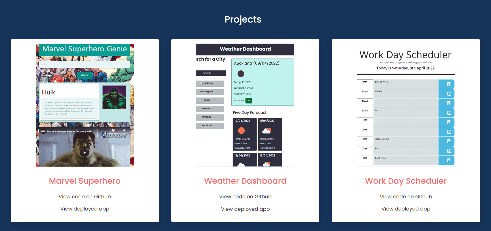
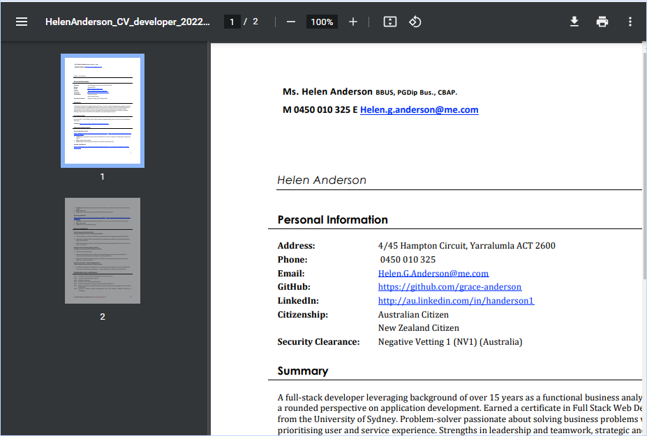

# Professional Portfolio

## Purpose
The professional portfolio showcases the developer's skills and projects to potential employers, recruiters and collaborators

[Deployed Portfolio](https://grace-anderson.github.io/updated-portfolio/)

## Technologies
* HTML5
* CSS3
* CSS animation
* JavaScript
* Bootstrap CSS Library

## Features
The portfolio was designed for mobile first and is responsive through all screen sizes. CSS animation is used to demonstrate skill and originality. A pdf version of the developers's resume is attached for download. Three exemplary projects are displayed with links to their code and deployments. The portfolio also contains the developer's contact details and links to github and linkedin profiles. CSS animation is used to demonstrate the developers skills and guide the user's eye up and down the page, to the navigation menu and the projects.

[Portfolio repository on Github](https://github.com/grace-anderson/updated-portfolio)

## Mock-Ups

### Mock up 1: App demonstration (mobile)
The gif demonstrates the portfolio's functionality and features. A mobile screen size is used to demonstrate the mobile first approach.

 

### Mock up 2: Project list (large screen)

### Mock up 3: Download Resume

## Contact

Email: [helen.g.anderson@me.com](mailto:helen.g.anderson@me.com)

Phone: +61450010325